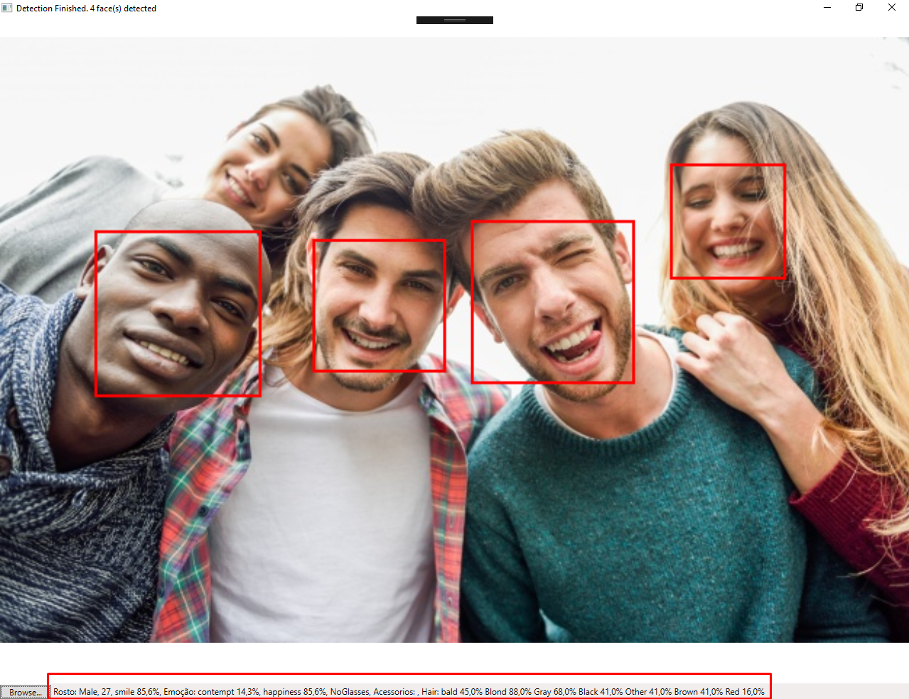

# Aplicativo de Reconhecimento Facial

Nesta quarentena resolvi conhecer algumas tecnologias que ainda não havia tido contato, então resolvi identificar rostos em imagens, logo cheguei a API Cognitiva da Microsoft, então baseado em seu Get Started, desenvolvi a solução que detecta emoção, idade, cor do cabelo...

Lembrando, se sua quarentena não estiver sendo produtiva tudo bem,  se estiver sendo, tudo bem também. O importante e você estar se sentindo bem.

#ficaemcasa se puder :)

###   Exemplo

## Contato
Linkedin: https://www.linkedin.com/in/guilhermebatistamagalhaes/
